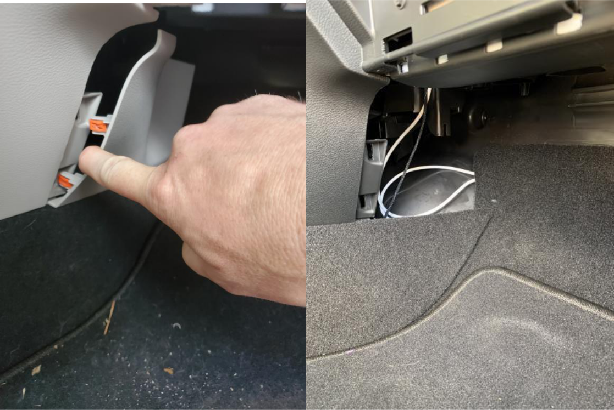
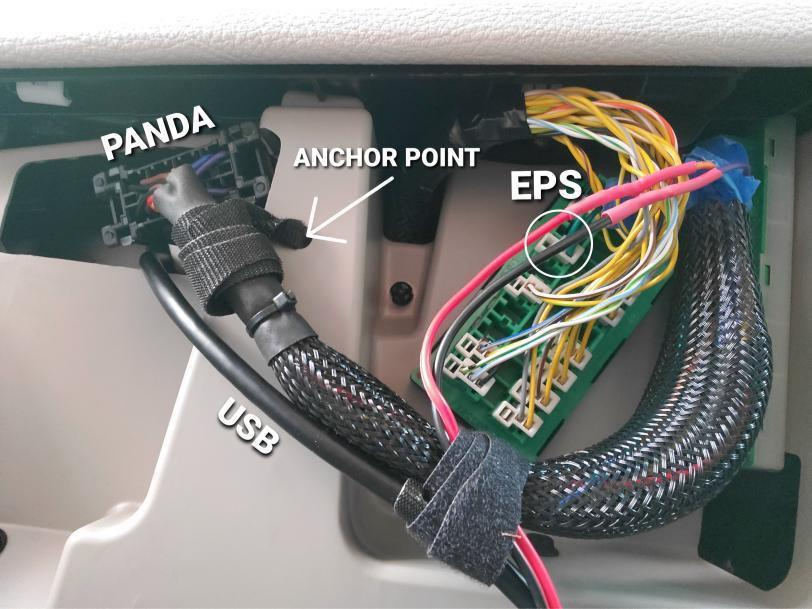

# White Panda Mod (WP Mod)

## Disclaimer

This guide is intended for **educational purposes only**. Some modifications are strictly for **off-road or experimental use**. Certain changes may:

- Be **dangerous** and impair vehicle safety.
- Violate **U.S. federal, state, or local laws** (e.g., emissions standards or tampering regulations).
- **Void warranties** or damage your vehicle.
- Result in a ban from services such as **Comma Connect** or **Cabana**.

By using this guide, you agree to accept full responsibility for your actions and absolve the author of any liability for damage, injury, or legal consequences.

---

Thanks to imadethem for the original guide.

# White Panda Pacifica Mod Instructions

The instructions below are for the hardware portion of the White Panda Pacifica Mod to allow Pacificas to steer to zero and increase torque. This modification involves flashing and attaching a Comma White Panda (WP) to a custom OBDII wire harness, which is wired to the star connector in the glove box, and a 12v power source to power the WP.

## Supply List

[Discord Channel](https://discord.com/channels/812934069591080962/821388732820094987/829069554449383455)

You will also need some 20 AWG wire and connectors to bridge this wire to the OBDII harness. Note that this connection is crucial, and should be made as solid as possible to prevent power interruption.

---

## STEP 1: Flash WP and Install `xps_fca` on Comma 2

You will want to first flash the White Panda (WP) with this branch:
- [xps_seps Branch](https://github.com/xps-genesis/panda/tree/xps_seps)

Then install this branch on your Comma 2:
- [xps_fca Branch](https://github.com/xps-genesis/openpilot/tree/xps_fca)

---

## STEP 2: Create the OBDII Harness

First, prepare the OBDII harness using this pinout diagram:

Find these wires on the harness, and mark them with tape for identification; you should have 3 pairs of wires once complete. Attach the metal connectors to the four CAN1 H/L and CAN3 H/L wires, then place them into the plastic star connectors as shown below:

You should have a harness similar to this once you are done:

---

## STEP 3: Prepare New Star Board (eBay Star Board)

To avoid confusion, we’ll refer to this board purchased for the mod as the eBay star board. First, remove the white backing off the eBay star board, then cut off the second tab as shown:

Then, on the back of the eBay star board itself, use a small file or Dremel to carefully sever the connection to the other connectors on the board:

Replace the white back and the eBay star board is ready for installation.

---

## STEP 4: Locate and Tap into 12v Switched Power

Remove the plastic cover by carefully prying around the USB panel with a plastic trim tool, then remove the harness from the USB:

Now, using the plastic trim remover tool, remove this side panel in the passenger footwell:

The video link below shows how to remove the glove box and fabric backing to access the space behind the glove box and the star connector. Note that pushing in the tabs on the sides of the glovebox to drop it for the first time requires a lot of force, and this is normal.

- [How To Change 2017 - 2021 Chrysler Pacifica Cabin Air Filter - Replace Remove Replacement Location](https://www.youtube.com/watch?v=U5MnSaoD4eY)

Connect the Posi-Tap Connectors as shown below. On the USB harness, the pink wire is hot, black wire is ground—verify with a voltmeter. Run your 12v wire from the USB through the access panel, up into the glove box area. Use zip ties or velcro straps to affix the wire as you go to minimize movement of the wires. You can replace the USB harness and pop the USB panel back in once you have run the wire.

---

## STEP 5: Install eBay Star Board, OBDII Harness, and 12v Power

Now that the 12v wires are in the area where we will be installing the harness, you can wire the hot and ground to the OBDII harness. Solid, automotive-grade connectors are recommended for this task, as we want to ensure a solid connection and power. **Note:** if the WP loses power while operating the vehicle, you will lose power steering.

Look up into the cavity and you will see the star connector we will be patching into:

The star connector is the large green board with multiple wiring harnesses coming from it. The red outline in the example photo shows where we will be placing the eBay star board for this mod:

The photos above show how the eBay star board clips in place, and also the EPS (Electronic Power Steering) wire harness, which has a yellow and yellow/brown wire. If you have any doubts about which wire it is, remove the likely suspect, then turn on the vehicle. With the EPS removed, the power steering will be off, and there will be a warning light on the dash indicating there is no power steering:

Remove the EPS from the Pacifica star board, then plug it and the CAN3 connector from the OBDII harness into the eBay star board:

The CAN1 connector from our harness goes into the Pacifica star board to replace the EPS connector. Now the harness should be connected to 12v power and wired into the vehicle star board. Attach the WP to the OBDII harness, and use zip ties or velcro to secure the harness and minimize movement.

To allow ease of access for flashing WP in the future, you can run a USB-A cable back from the WP into either the glovebox or behind the passenger footwell panel:

Here’s another option for storing the WP and OBDII harness to be secure and out of the way:

At this point, you can turn the vehicle on, verify you don’t have any EPS error messages on the dash, and confirm power steering is working. Replace the panels and glovebox, and you are done!
